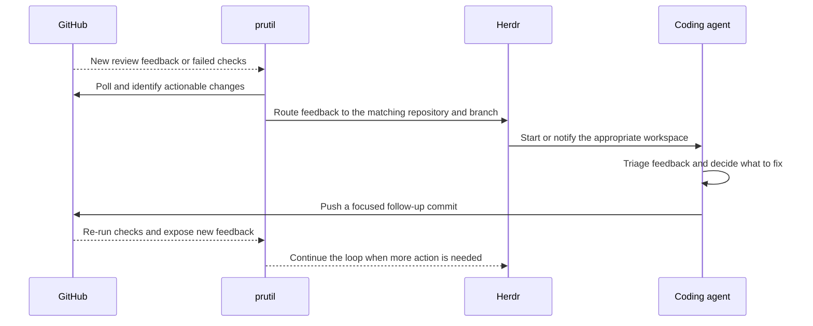

# prutil

A terminal dashboard for the GitHub pull requests you have open, across every
repository your account can see.

The list on the left shows each pull request with a coloured dot for its CI
state, its age, repository, branches, number, review state and diff size. The
pane on the right shows the selected pull request's WATCH summary and
individual GitHub Actions checks.

## Self-healing pull requests

prutil can turn a pull request into a lightweight feedback loop instead of a
static page you have to keep checking. Watch a pull request and it polls for
new review feedback and failed checks, deduplicates work it has already handed
off, and routes actionable work to the matching coding-agent workspace through
[herdr](https://herdr.dev). The agent triages the feedback, separates real
issues from noise (including automated review noise), makes a focused fix,
pushes a follow-up commit, and lets GitHub run the checks again.

The loop is deliberately human-in-the-loop: prutil observes and coordinates;
the agent proposes changes through normal commits and pull-request feedback,
while people retain control of review, merge, retries and ambiguous decisions.



## Requirements

- Go 1.26 or newer, if you are building from source.
- The [gh CLI](https://cli.github.com), installed and logged in:

  ```sh
  gh auth login
  ```

prutil shells out to `gh`, so it uses your existing gh credentials and never
stores a token of its own. If you would rather use a personal access token,
export `GH_TOKEN` (or `GITHUB_TOKEN`) and gh will pick it up. `GH_HOST` selects
a GitHub Enterprise host.

## Install

```sh
task install     # tidy, vet, lint, test, build and go install
```

or, without [go-task](https://taskfile.dev):

```sh
go install github.com/relloyd/prutil/cmd/prutil@latest
```

## Usage

```sh
prutil
prutil -limit 20
prutil -query 'is:open is:pr author:@me org:acme sort:created-desc'
```

| Flag | Default | Meaning |
| --- | --- | --- |
| `-query` | `is:open is:pr author:@me archived:false sort:created-desc` | the GitHub search used to find pull requests |
| `-limit` | 100 | how many pull requests to load |
| `-closed-query` | `is:pr author:@me is:closed archived:false sort:updated-desc` | the search used by the recently closed view |
| `-closed-per-repo` | 3 | how many closed pull requests any one repository contributes |
| `-closed-repo-limit` | 30 | how many repositories the closed view may query individually |
| `-skip-auth-check` | false | skip the `gh auth status` check at startup |
| `-dry-run` | false | record what would be sent to a coding agent without sending it |
| `-mouse` | true | click to select and scroll with the wheel; `-mouse=false` leaves the terminal its own wheel and drag-to-select |
| `-version` | | print the version and exit |

## Keys

| Key | Action |
| --- | --- |
| left click | select a pull request in the list |
| `j` / `k` or `↓` / `↑` | move within the focused pane; in detail, select WATCH or CHECKS |
| `g` / `G` or `home` / `end` | jump to the first or last item |
| `l` or `→` | focus detail from the list, or drill into the selected detail section |
| `h`, `←` or `esc` | go back one level |
| `enter` | open the selected pull request, or the selected check, in your browser; on the WATCH heading, drill in as `l` does |
| `y` or `c` | copy the selected pull request's URL, or the selected check's, to the clipboard |
| `r` | refresh from GitHub |
| `a` | auto-refresh: reload every 30s, five times over. press again to add five more |
| `w` | watch the selected open pull request, or stop watching it |
| `W` | hand the selected pull request's open review feedback to a coding agent now, creating one when needed |
| `F` | investigate the selected pull request's failed checks now |
| `R` | trigger an AI review on the selected open pull request by posting the configured comment |
| `N` | check the selected open pull request for new review feedback and notify an existing agent |
| `tab` | switch between your open and your recently closed pull requests |
| `s` or `,` | open settings: configure notifications, polling intervals, review triggers, and coding agent settings |
| `?` | open the shortcut overlay: type to filter, `enter` to run the highlighted shortcut, `esc` or `?` to close |
| `q` or `ctrl+c` | quit |

Below 80 columns the two panes collapse into one: the list fills the terminal,
clicking a row selects it, `l` swaps to detail, and `h` swaps back. When WATCH
is available, select it above CHECKS and press `l` or `enter` again to see its
full schedule, activity and handoff details.

The footer has one line, so it lists the actions and leaves moving about to the
arrow keys. `?` opens an overlay listing every shortcut with a sentence on what
it does. Start typing to fuzzy-filter it (`agent`, `copy`, or a key such as `W`),
move with `↑` and `↓` or half a page at a time with `ctrl+d` and `ctrl+u`, press
`enter` to run the highlighted shortcut, and `esc` to return. While it is open,
keys go to the filter, so `q` types rather than quits; `ctrl+c` still quits.

Copying uses whichever clipboard program your platform provides: `pbcopy` on
macOS, `clip` on Windows, and `wl-copy`, `xclip` or `xsel` on Linux, whichever
is installed first. If none is, prutil says which ones it looked for.

## Desktop notifications

prutil can tell you when one of your open pull requests changes, with a
notification from your operating system, so you can leave it running in a
terminal you are not looking at. It raises one today:

| Notification | When |
| --- | --- |
| Pull request approved | GitHub's review decision turns to approved, or, in a repository without review rules, the pull request gets its first approval |

It is on by default. Press `s` (or `,`) to open the settings pane, where you can
view and edit all prutil configuration options. In the pane:
- `space` toggles boolean settings on or off.
- `+` / `-` steps poll intervals and durations.
- `←` / `→` cycles enum options (such as agent fallback strategies).
- `enter` enters inline editing for strings and custom numbers, launches `$EDITOR`
  for prompt templates, or opens sub-panes for repository mappings and discovery roots.
- `d` resets the selected setting to its default value.
- `tab` / `shift+tab` jumps between settings sections.
- `t` sends a test desktop notification.
- `esc` closes the pane.

A change is saved to `config.yaml` as soon as you make it: prutil changes that
one value in place and leaves the rest of the file, your comments included,
exactly as it was. A configuration that does not parse, or that is written in a
shape prutil does not edit (such as a flow mapping), is left alone, and the pane
reports why.

While any notification is on, prutil reads every open pull request every two
minutes (`notifications.interval`), using the watcher's cheap query: one
request, and one rate limit point, per hundred pull requests. A watched pull
request is also read on the watcher's own schedule, and a refresh reads the
whole list, so either may notice a change sooner. The first reading of each
pull request after prutil starts only records where it stands; a pull request
approved while prutil was not running is not announced.

These are separate from `herdr.toast`, which is herdr's own notification of a
handoff. New review feedback and failed checks are what the watcher hands to
an agent, so they are not duplicated here.

Notifications are shown with `osascript` on macOS, `notify-send` (libnotify) on
Linux, and Windows PowerShell on Windows. macOS files `osascript`'s
notifications under Script Editor, so if the test notification does not
appear, allow notifications for Script Editor in System Settings ›
Notifications. The title and body are passed as arguments rather than as part
of a script, and control and invisible formatting characters are removed from
them first, since anybody who can open a pull request chooses its title.

## Auto-refresh

`a` reloads the view on screen every 30 seconds, five times, and then stops.
That is two and a half minutes of watching a pull request's checks turn green
without touching the keyboard. Press `a` again at any point during the run and
another five reloads are added, so a long CI run is a matter of topping the
counter up rather than holding a mode open. The header counts down what is
left, and once it runs out prutil is back to refreshing only when you press
`r`.

Each automatic reload is the same work `r` does, so it costs the same one
request for the list plus the checks it warms.

## Watching, and handing work to an agent

`w` marks a pull request as watched. The row grows a `◉`, the header counts how
many are marked, and the mark survives quitting: it is kept in prutil's own
directory, not in the terminal. Marking one is available in the open list only,
because polling addresses a pull request by the node id that list came with;
taking a mark off works from any view.

The header's tally reads `◉ 3 ◎ 1 watched · next poll 45s`. The filled count is
how many watched pull requests prutil is still asking GitHub about; the hollow
one, shown only when it is not zero, is how many are still armed but not being
asked about — either they have gone dormant (see below) or they are not in the
list prutil is holding, so there is nothing to address a poll to. Together they
add up to everything `w` has marked, and a row carries the same glyph as the
half of the tally it belongs to. `next poll` is how long until the soonest of
the active ones is read again.

A watched pull request stops being watched on its own once prutil sees it
merged or closed in the recently closed view, and says which ones it retired.
That is the only thing besides `w` that ever disarms, and it waits to be shown
a finished pull request rather than inferring one: the open list is narrowed by
`-query` and `-limit`, so a pull request can drop out of it and still be open.
Until that view is next loaded a finished pull request stays armed, counted in
the hollow half of the tally; nothing polls it, so it costs no requests.

From then on prutil watches that pull request for review feedback, and when
some appears it gives it to a coding agent through
[herdr](https://herdr.dev). Open feedback means a review thread that is neither
resolved nor already answered by you, so a conversation you have had the last
word in is left alone. `W` does the same thing on demand, for a pull request
you have not armed or one you want looked at again now.

Watching also monitors the pull-request check rollup. When the rollup fails,
prutil fetches the individual checks and waits until every check is terminal.
It then sends all failed checks together to an existing matching Herdr agent so
the agent can decide whether they share a cause. The default check prompt asks
the agent to fix failures related to the pull request with a follow-up commit,
re-trigger unrelated failures with `gh`, and ask for human assistance when it
has already retried an unchanged check or is unsure what to do. A missing agent
is recorded and notified, but does not cause automatic workspace provisioning.

`F` forces the same investigation immediately using the failures currently
known, even while other checks are pending. It bypasses automatic
deduplication but still requires an existing agent. When a failed check is
selected, `W` sends the same investigation while retaining `W`'s explicit
permission to provision a workspace and start an agent if needed.

Automatic investigations are recorded against the head commit, so a restart
does not resend the same failure. Pushing a new head allows a new investigation.
Stopping and starting the watch clears that remembered head and intentionally
allows the current failures to be investigated again.

To test watcher delivery with a code-line comment of your own, put this exact
marker in the thread's newest comment's Markdown source:

```html
<!-- prutil:test -->
```

GitHub hides the marker when it renders the comment. While that thread remains
unresolved, prutil treats it as feedback even though you wrote the latest
comment. The marker only works when it is in a comment written by the
authenticated viewer, and only in the thread's newest comment, so that a thread
somebody has since replied to falls off the list rather than being handed over
for as long as it stays open. It does not opt in an ordinary pull-request
conversation comment, a marker written by another reviewer, or an older reply
that is no longer the latest. Normal duplicate suppression still applies, so
the thread is handed over again only when it gains a new latest comment.

### Your own review comments as feedback

`watch.self_review` turns every unresolved review comment you wrote into
feedback, without needing the test marker in each one. It is off by default;
`s` toggles it under `WATCHING` and saves the change.

Either way, a reply your agent left must not read back as fresh feedback, or
the same work goes round again. The default prompt asks the agent to end every
review reply with this line:

```html
<!-- prutil:agent -->
```

prutil skips a thread whose newest comment carries that marker *and* was posted
by your own account. A reviewer writing it, deliberately or by quoting an agent
that did, changes nothing.

The prompt lives in `config.yaml`, which prutil writes once on first run and
never rewrites, and a prompt naming a `herdr.skill` is a slash command that says
nothing about replies at all. So prutil adds the instruction itself to any
prompt that renders without the marker: an installation from before the marker
existed, and a prompt you wrote yourself, both still ask for it. Write the
marker into your own prompt if you would rather word the request yourself.

`N` is a diagnostic trigger for the automatic path. It asks GitHub for the
selected open pull request's review threads and sends only feedback prutil has
not handed over before, so it is useful for confirming the normal handoff
behaviour without waiting for the watcher to spot a change. Like the watcher,
it follows `herdr.fallback` when no agent is working on the pull request.

prutil picks the agent rather than asking you to. It lists the agents herdr
knows about and asks git what each one's working directory is working on. An
agent qualifies when prutil set its workspace up for the pull request, when its
branch tracks the pull request's head branch or has the same name, or when its
checkout holds the pull request's latest commit. Branch names are never compared
for a likeness: `fix/retry` and `feat/retry` are different work, and so are
`main` and `chore/sync-main`. When more than one agent qualifies, the stronger
evidence wins, then the one ready for input. The prompt carries a warning only
when there is something true to say: the checkout is behind the pull request, or
holds its commits on a branch that will not reach it.

What happens when no agent qualifies is `herdr.fallback`'s to decide:

| `fallback` | When nothing is working on the pull request |
| --- | --- |
| `new` (default) | set a workspace up for it and start an agent there, the way `W` does |
| `none` | send nothing; the herdr notification and `handoffs.jsonl` name the agents prutil passed over |
| `repo` | hand the work to any agent in the repository, with the mismatch spelled out in the prompt |

Under `new` and `none` an agent busy with other work is never interrupted.
`repo` is the setting that allows it, and prefers an agent that really is on the
pull request whenever there is one. The terminal prutil is itself running in is
never given work. If the agent is busy prutil waits for it to finish, up to
fifteen minutes, and if it is stuck at a prompt of its own nothing is sent at
all. An agent prutil has just started is given a moment to come up, and is
prompted again if it does not react; an agent that was already running is
prompted once.

`W` is also the explicit consent to set up a workspace when no suitable agent
exists. It resolves a local checkout, fetches the pull request's
`pull/<number>/head` ref, reopens an existing matching herdr worktree when it
can, or creates a no-focus worktree workspace and starts the configured agent
there. Set `herdr.agent_kind` to the herdr agent kind to start (for example
`claude` or `copilot`); it is required whenever prutil starts an agent, and
without it a handoff with nothing to hand to reports that no local agent was
available. The watcher, `F` and `N` set a workspace up the same way under the
default `fallback: new`; set `fallback: none` to keep creation to `W` alone.

Nothing is ever handed over twice. Each thread prutil sends is remembered
against the comment it ended on, so pressing `W` again on a review whose
comments you have decided not to act on costs one GitHub request and sends
nobody anything. That is what makes it safe to leave a pull request watched.

Every attempt is recorded, sent or not, one JSON object per line, in
`handoffs.jsonl` beside the configuration. Start with `-dry-run`, which writes
that log and shows the status line without mutating a repository, worktree,
workspace, or agent.

The selected pull request's detail pane includes a `WATCH` section when it has
watch or handoff activity. It shows the current state-machine tier, cadence and
next check; work currently in flight; a bounded activity feed from this TUI
session; and the three most recent durable handoff attempts for that pull
request. The activity feed resets when prutil exits; `handoffs.jsonl` is the
cross-session record.

### What the watching costs

Watching a pull request is two questions, asked at very different rates.

The first is cheap and batched. One GraphQL request covers every watched pull
request at once, whatever repositories they are spread across, and reads only
enough to notice that something moved: the head commit, the check state, the
last-updated time, the conversation-comment total, and the total review-thread
count. It is one rate limit point per request, and one request per hundred
pull requests you have marked, which is where GitHub caps the node lookup it
uses.

The second is the expensive one, and it is asked only of the pull requests the
first one flagged, or of one that has gone five polls without being asked. That
second part matters: a reply inside an existing review thread moves neither
count, so a counter on its own would miss it.

That precise read covers the first 100 code-review threads. For each one it
reads the opening comment's author and body plus the newest comment's author,
id and body. The newest body is fetched only so the self-test marker can be
used in the viewer's latest reply; arbitrary historical replies are not
scanned. The top-level pull-request conversation-comment count is only a
change signal; it is not a code-review thread and is never handed to an agent.

How often the first question is asked depends on what the pull request is
doing:

| The pull request | Asked about |
| --- | --- |
| has checks running | every 30 seconds |
| has nothing in progress | after 2 minutes, then 4, 8, 16, and 30 |
| has been given to an agent | after 10 minutes, then 20, 40, and 60 |
| has not changed for about two hours | not at all |

Anything at all changing puts a pull request back to the top of that ladder. A
pull request prutil has stopped asking about is still armed, and its `◉` turns
hollow to say so; `r` wakes it, along with everything else, while `R` (triggering
an AI review) wakes that specific pull request.

### Configuration

prutil reads `config.yaml` from `$PRUTIL_HOME`, else `$XDG_CONFIG_HOME/prutil`,
else `~/.config/prutil`. On first startup it creates a complete editable
template there. The file is yours: the only thing prutil ever writes back is a
setting you change in its settings pane, one value at a time. Every key remains
optional, and these are the defaults:

```yaml
herdr:
  agent_kind: claude        # required whenever prutil starts an agent
  skill: pr-comment-triage  # the skill the default prompt invokes
  wait_for_idle: 15m        # how long to wait for a busy agent
  dry_run: false
  toast: true               # show a herdr notification alongside each handoff
  fallback: new             # no agent on the pull request: "new" sets one up,
                            # "none" reports it, "repo" uses any agent in the repo
  # Optional separate Go template for failed-check investigations. It receives
  # Repo, Number, URL, Title, HeadRef, BaseRef, Checks and Note.
  check_prompt: "..."
watch:
  active_interval: 30s      # while checks are still running
  base_interval: 2m         # once nothing is in progress
  max_interval: 30m         # where the backoff stops growing
  notified_interval: 10m    # after a handoff, when an agent is at work
  max_notified_interval: 60m
  idle_interval: 10s        # how often a busy agent is re-read
  dormant_after: 3          # polls at the cap before prutil stops asking
  force_precise_every: 5    # polls before the expensive question is asked anyway
  self_review: false        # treat every unresolved comment of yours as feedback
  self_test_marker: "<!-- prutil:test -->"  # "" turns it off
review:
  comment: "/gemini review"  # comment posted by R to trigger an AI review; "" turns it off
  repos:
    acme/widgets: "@coderabbitai review"  # optional per-repository override
notifications:
  interval: 2m              # how often every open pull request is read while one is on
  events:
    approved: true          # a pull request is approved; s in prutil toggles it
repos:
  acme/widgets: ~/src/widgets  # optional explicit checkout for W
discovery:
  roots:
    - ~/src                    # optional roots scanned after repos misses
security:
  trusted_associations:        # whose feedback may reach an agent unasked
    - OWNER
    - COLLABORATOR
  trusted_authors:
    - "gemini-code-assist[bot]"  # [bot] matches only a GitHub App
  require_sandbox: true        # automatic handoffs only to sandboxed agents
```

Discovery roots are walked four levels deep, and a checkout's origin remote is
read from its own `.git/config` before git is asked about it, so pointing at a
directory of a hundred repositories costs a hundred small file reads rather
than several hundred forked processes.

With `skill` set, the prompt is `/<skill> <pull request url>`. Without it,
prutil spells the job out instead. Either can be replaced with `herdr.prompt`,
a Go template given `Repo`, `Number`, `URL`, `Title`, `HeadRef`, `BaseRef`,
`Skill`, `UnresolvedCount`, `NewCount` and `Note`. Failed-check handoffs use
`herdr.check_prompt`, whose `Checks` value contains the failed check entries
and whose default prompt is designed for deciding between a follow-up commit,
a retry, and human assistance.

`security` is the trust boundary between whoever can comment on a pull request
and the agent that acts on what they wrote. On a public repository that is any
GitHub account, so feedback is handed over unasked only when everyone who has
spoken in every unresolved thread is you, an author whose GitHub
`authorAssociation` is listed, or a login in `trusted_authors`. Anything else
is held: prutil sends nothing, records it, and tells you who caused it.

Both lists are editable from the settings pane (`s`, then the SECURITY
section): `enter` opens the list, `a` adds an entry and `d` removes the
selected one, saved to `config.yaml` as you go. An association that GitHub
never reports, or a name that is not a login, is refused with an explanation
rather than quietly trusting nobody.

`MEMBER` is not a default. In a large organisation it means only that somebody
belongs to it, which implies no write access at all; add it if yours is small
enough for membership to mean something. An entry ending in `[bot]` matches
only a GitHub App, so a person registering that name as their login does not
inherit its trust. Writing a key as `[]` is honoured as written and trusts
nobody by that route, which is stricter than leaving it out.

A pull request is held for a second reason too: a comment carrying text
github.com does not render. Tag characters, zero-width and bidi controls can
put a paragraph of instructions into a comment that looks empty to you and
reads normally to an agent, so prutil holds the pull request whoever wrote
them — a trusted reviewer's account is exactly the one worth taking. HTML
comments only count in somebody else's prose, since review bots use them as
metadata and prutil's own markers are HTML comments. Emoji are safe: the
zero-width joiner every family and profession emoji is built from is exempt
between two emoji, and nowhere else.

prutil also will not create a workspace over a branch that is not yours. `W`
and the automatic `fallback: new` path check out `pull/<number>/head` and start
an agent in it, and an agent started in somebody else's checkout loads that
repository's own settings, hooks and instruction files — hooks run outside any
sandbox. Only your own pull requests and `trusted_authors` are provisioned
over; `-query` can list anyone's, which is when this matters. An agent you have
already checked out there yourself still takes the work, because that is your
own choice rather than prutil's.

A held pull request holds its failed checks with it, because the agent a check
investigation starts reads the same pull request. Resolving the thread on
GitHub releases the hold at the next poll; otherwise `W` and `F` both act on it
after a second press that names what it is waving through. That press covers
one send, however much is wrong with the pull request, and is not remembered:
the next attempt asks again, and nothing you wave through puts the pull request
back on the automatic loop.

Separately, every value prutil puts into a prompt is cleaned first: control and
format characters are dropped, single-line fields stay on one line, and a failed
check's link is kept only when it points back at the same GitHub the pull
request came from. A prompt carrying a control character is refused outright
rather than typed into an agent's terminal, so a `herdr.prompt` template of your
own containing one will fail the handoff and say so.

prutil only acts automatically on a pull request whose review threads it has
actually read, so the first failed-check handoff after starting prutil waits
one polling interval while it reads them. The same wait applies when GitHub
refuses that read: not knowing who has commented leaves the automatic paths
shut rather than open. `W` and `F` are your own key presses and do not wait.

#### Sandboxed agents

A Claude Code agent that prutil starts runs inside Claude's own sandbox. Its
shell commands can write only inside its worktree, reach only the domains the
policy allows, and cannot reach herdr's socket, so a talked-into agent cannot
type into your other panes. It cannot ask its way out, either: the sandbox is
strict. What it can still do is what the work needs: commit, run the tests,
push, and reply on threads with gh.

The policy is `sandbox/claude-settings.json` in prutil's directory. prutil
writes it the first time it starts a Claude agent and never again, so it is
yours to edit. Before each start, prutil asks Claude what the policy gives the
agent, and refuses to start it if the answer is not sandboxed. Two things are
added at each start rather than kept in your file:

- the SSH agent's socket, which moves every time a Mac boots;
- git rules that send the pull request owner's repositories over HTTPS, with
  gh as the credential helper. SSH cannot get out of Claude's sandbox on macOS.
  The rules apply to that agent's session only; your own git configuration,
  including any rewrite of HTTPS to SSH, is not touched. If your organisation
  enforces SSO, your gh token needs authorising for it, as your SSH key did.

With `security.require_sandbox` on, which is the default, automatic handoffs
to Claude, Copilot CLI, and agy require a contained agent. prutil passes over
an uncontained agent on the pull request rather than starting another beside
it; `W` and `F` can still hand work to it explicitly.

Copilot CLI (1.0.88) starts with `--experimental --sandbox` and strips common
AWS token variables from shell and MCP environments. GitHub tokens stay
available so `gh` can push and reply. agy (1.2.11) starts with
`--sandbox`. Neither has a sandbox status command: prutil checks their flags
and their **existing, user-owned settings**; it does not change vendor files
or relocate sign-in.

**For Copilot**, set `sandbox.allowBypass: false`,
`sandbox.userPolicy.network.allowLocalNetwork: false`, and include absolute
paths to `~/.ssh`, `~/.aws`, `~/.gnupg`, `~/.netrc`, `~/.config/herdr` and
`~/.config/prutil` in `sandbox.userPolicy.filesystem.deniedPaths`.

**For agy**,
set `enableTerminalSandbox: true`, `toolPermission: "proceed-in-sandbox"`,
and restricted `read_url(domain)` entries in `permissions.allow`; do not
allow `unsandboxed` or wildcard URL rules. With a missing or permissive
policy, automatic handoffs are refused until you configure it.

These checks
are **not proof of OS isolation**: a live agent must still verify secret
reads, network access, and herdr socket denial on your machine.

The WATCH history says what each handoff went to, for example
`claude w3:p1 · sandboxed, strict`. After your first `W` on a test pull
request, check that the agent's push reached GitHub: that is the one part of
the sandbox that could not be verified from here. If it did not, set
`require_sandbox: false` and say what the agent reported.

Explicit `repos` entries win. When none exists, prutil checks its private
`repos.json` cache and then scans `discovery.roots`, validating every candidate
against its origin remote before it can be used. Stale cache paths are ignored
and refreshed. GitHub poll intervals are clamped to fifteen seconds at the
shortest, so a typo cannot turn a dashboard into a load test.

## Views

`tab` switches the list between your open pull requests and your recently
closed ones. Each view keeps its own cursor and scroll position, and the closed
view is not fetched until the first time you show it.

The closed view is grouped: no repository contributes more than
`-closed-per-repo` rows, so a single busy repository cannot fill the screen and
hide everywhere else you have been working.

If GitHub refuses some of those per-repository queries, which a very large
organisation can provoke, the header says how many repositories were
unreachable and the rest of the list is shown anyway. Press `r` to try again.

Note that `-closed-query` inherits `archived:false` from the open view. If most
of your history is in repositories that have since been archived, drop that
qualifier to see it:

```sh
prutil -closed-query='is:pr author:@me is:closed sort:updated-desc'
```

## How it stays quick

The headline list is one GraphQL request, which includes the check rollup that
colours each dot, so the first screen appears after a single round trip. The
individual checks are fetched afterwards, in the background for the top of the
list and on demand as you move, with at most four gh processes at a time. Both
are cached until you press `r`.

The closed view usually costs one request too. It sweeps your closed pull
requests newest first, and when that sweep reaches the end of the search it
already holds everything, so the grouping is exact and nothing more is fetched.
Only when the sweep runs out of room first does it go further. It reads a little
further down the same search, collecting nothing but repository names, then
queries the ones that came up short directly. Nothing enumerates an
organisation's repositories, so the work does not grow with the size of the
organisations you belong to. Those per-repo searches are batched under GraphQL
aliases, so three repositories cost one request and one rate limit point.

Batches are small on purpose. GitHub gives a single GraphQL document about ten
seconds before returning a 502, and that budget is spent faster in a large
organisation, so the closed view trades round trips for headroom.
