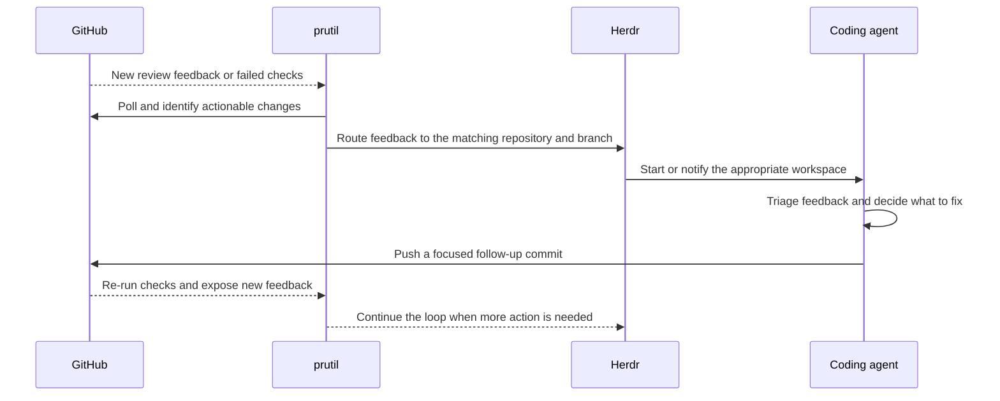

# prutil

prutil is a terminal dashboard for the GitHub pull requests that you have open.
It shows the pull requests from every repository that your account can see.

The list is on the left. Each pull request in the list shows these items:

- a colored dot for the CI state
- the age
- the repository
- the branches
- the number
- the review state
- the size of the diff

The pane on the right shows the WATCH summary of the selected pull request. It
also shows the individual GitHub Actions checks.

When the detail pane becomes narrow, prutil makes the check names shorter. It
removes the workflow labels first. If necessary, it then removes the durations.
This keeps the start of each name visible.

## What prutil can do

prutil acts in two ways:

- It acts on its own for the pull requests that you ask it to watch.
- It acts when you push a key.

**On its own**, for each watched pull request (`◉`), prutil does these things:

- It sends new review feedback to the coding agent that works on the pull
  request.
- It waits until all checks have finished. If some checks have failed, it sends
  the failed checks to the agent. It does this one time for each head commit.
- If no agent is on the pull request, it sets up an agent in a new worktree.
  This is the default (`herdr.fallback: new`). It does this only for branches
  that you trust: your own branches, branches that you adopted, and branches
  of the authors in `security.trusted_authors`.
- If a person outside your trust boundary wrote a comment, prutil holds the pull
  request. Hidden text in a comment also holds the pull request. prutil sends
  nothing until you tell it to.
- When all checks on a new head commit pass, it posts the checks passed comment
  (for example, `/deploy staging`). It does this only if you armed the comment
  on that pull request with `P`.
- It stops the watch when it sees that the pull request is merged or closed.

You can also switch on these two functions:

- prutil watches the new pull requests that you open. You do not push `w`.
- Your desktop shows a notification when a pull request is approved or when its
  checks pass.

**When you push a key**, prutil acts on the selected pull request. Two keys are
switches. A switch continues to work in the background until you push the key
again:

- `w` switches the watch on or off. The watch does all the actions in the "On
  its own" list above.
- `P` switches the checks passed comment on or off. Use it on a watched pull
  request.

The other keys act one time, immediately:

- `W` sends the open review feedback of the pull request to an agent.
- `F` sends the failed checks of the pull request to an agent.
- `N` sends only the feedback that prutil did not send before.
- `R` posts a comment to ask a review bot for a review. The default comment is
  `/gemini review`. prutil never posts this comment on its own.
- `+` adopts the pull request of another person. After you adopt it, the other
  keys also work on it.

prutil posts nothing to GitHub except the comments from `R` and `P`. The agent
makes the replies, the commits, and the check re-runs.

| Feature | Trigger | Switched by | Default |
| --- | --- | --- | --- |
| [Watch a pull request](#watching-and-handing-work-to-an-agent) | `w` | each pull request | not watched |
| [Watch new pull requests](#watching-new-pull-requests-automatically) | on its own, every 2 minutes and after `r` | `watch.auto_watch` (New PR watching), `watch.list_interval` | off |
| Watch new drafts also | with the function above | `watch.auto_watch_drafts` (Draft PR watching) | off |
| Send review feedback to an agent | on its own when watched; `W` now; `N` now, new feedback only | `herdr.prompt`, `herdr.skill` | on when watched |
| [Treat your own comments as feedback](#your-own-review-comments-as-feedback) | on its own when watched | `watch.self_review` for all comments; `watch.self_test_marker` for one comment | off; marker on |
| Send failed checks to an agent | on its own when watched, after all checks finish; `F` now; `W` on a failed check | `herdr.check_prompt` | on when watched |
| Set up a workspace and agent when no agent is on the pull request | any send that finds no agent | `herdr.fallback`: `new`, `none` or `repo`; `W` is always permitted | `new` |
| [Hold work from untrusted commenters](#configuration) | each send; a second push of `W` or `F` sends one time | `security.trusted_associations`, `security.trusted_authors` | on |
| [Require a sandboxed agent](#sandboxed-agents) | each automatic send | `security.require_sandbox` | on |
| Post an AI review comment | `R`, pushed two times | `review.comment`, `review.repos` | `/gemini review` |
| [Post a comment when checks pass](#posting-a-comment-when-checks-pass) | on its own after you arm it with `P`, one time for each head commit | `checks_passed.comment`, `checks_passed.repos` | off, no comment |
| [Desktop notification on approval](#desktop-notifications) | on its own, every 2 minutes | `notifications.events.approved`, `watch.list_interval` | on |
| Desktop notification when checks pass | on its own, every 2 minutes | `notifications.events.checks_passed` | off |
| [Adopt the pull request of another person](#adopting-somebody-elses-pull-request) | `+` to adopt, `-` to release | each pull request | none |
| [Auto-refresh](#auto-refresh) | `a` | each push | off |
| Record sends without making them | `-dry-run` | `herdr.dry_run` | off |

You can change each setting in the table in the settings pane (`s`). You can
also change it in [`config.yaml`](#configuration).

### Words that prutil uses

| Word | Meaning |
| --- | --- |
| watch | prutil polls the pull request and acts on the result. This is not the same as watching a repository on GitHub. |
| poll, re-read | prutil polls a watched pull request on the POLL TIMING intervals. It only re-reads your other open pull requests, every `watch.list_interval`. It does this only when a notification or new PR watching is on. |
| auto-watch | prutil watches new pull requests and you do not push `w`. This is not the same as auto-refresh (`a`), which only reloads the screen. |
| feedback | An unresolved review thread. The newest comment in the thread is not yours. |
| send | prutil gives feedback or failed checks to a coding agent through herdr. The log file, `handoffs.jsonl`, calls each send a handoff. |
| agent | A coding agent, for example Claude Code, that runs in a herdr pane. |
| held | prutil found a comment that it does not send unless you tell it to. The comment is from a person outside the trust boundary, or it contains hidden text. |
| notification | A desktop notification from your operating system, for example an approval. |
| toast | The notification from herdr that tells you a send occurred (`herdr.toast`). |
| check | A CI check on the head commit of the pull request. The rollup is the verdict of GitHub for all the checks. |

## Self-healing pull requests

prutil changes a pull request into a short feedback loop. You do not have to
look at a static page again and again.

Watch a pull request. Then prutil does these steps:

1. It polls for new review feedback and failed checks.
2. It does not repeat work that it already handed off.
3. It sends the work to the matching coding-agent workspace through
   [herdr](https://herdr.dev).

The agent then does these steps:

1. It triages the feedback.
2. It separates real issues from noise, including noise from automated reviews.
3. It makes a focused fix.
4. It pushes a follow-up commit.
5. GitHub runs the checks again.

The loop keeps a human in control. prutil observes and coordinates. The agent
proposes changes in normal commits and in pull request feedback. People keep
control of the review, the merge, the retries, and the decisions that are not
clear.


```mermaid
sequenceDiagram
    participant GitHub
    participant prutil
    participant Herdr
    participant Agent as Coding agent

    GitHub-->>prutil: New review feedback or failed checks
    prutil->>GitHub: Poll and identify actionable changes
    prutil->>Herdr: Route feedback to the matching repository and branch
    Herdr->>Agent: Start or notify the appropriate workspace
    Agent->>Agent: Triage feedback and decide what to fix
    Agent->>GitHub: Push a focused follow-up commit
    GitHub-->>prutil: Re-run checks and expose new feedback
    prutil-->>Herdr: Continue the loop when more action is needed
```

## Requirements

- Go 1.26 or newer. You need it only to build from source.
- The [gh CLI](https://cli.github.com). Install it and log in:

  ```sh
  gh auth login
  ```

prutil calls `gh`. It uses your existing gh credentials. It never stores a
token of its own.

To use a personal access token, export `GH_TOKEN` (or `GITHUB_TOKEN`). The gh
CLI uses the token. `GH_HOST` selects a GitHub Enterprise host.

## Install

```sh
task install     # tidy, vet, lint, test, build and go install
```

If you do not have [go-task](https://taskfile.dev), use this command:

```sh
go install github.com/relloyd/prutil/cmd/prutil@latest
```

## Usage

```sh
prutil
prutil -limit 20
prutil -query 'is:open is:pr author:@me org:acme sort:created-desc'
```

| Flag | Default | Meaning |
| --- | --- | --- |
| `-query` | `is:open is:pr author:@me archived:false sort:created-desc` | The GitHub search that finds the pull requests |
| `-limit` | 100 | The number of pull requests to load |
| `-closed-query` | `is:pr author:@me is:closed archived:false sort:updated-desc` | The search for the recently closed view |
| `-closed-per-repo` | 3 | The maximum number of closed pull requests from one repository |
| `-closed-repo-limit` | 30 | The maximum number of repositories that the closed view queries one by one |
| `-skip-auth-check` | false | Do not do the `gh auth status` check at startup |
| `-dry-run` | false | Record what prutil would send to a coding agent. Do not send it |
| `-mouse` | true | Click to select and use the wheel to scroll. With `-mouse=false`, the terminal keeps its own wheel and drag-to-select |
| `-version` | | Print the version and exit |

## Reading a row

```
▌ ● ◉ ↗ ⇄ #42 acme/widgets                    3d old
  Retry the GraphQL search on 502
  fix/retry → main  DRAFT  by alice          +40 -3
  APPROVED  ✓12  2 open threads              upd 5m
```

| Mark | Meaning |
| --- | --- |
| `●` | The checks. Green means passed. Red means failed. Amber means still running |
| `○` | GitHub reports no checks for the head commit |
| `◉` | Watched, and prutil polls it (`w`) |
| `◎` | Watched, but prutil does not poll it. It is quiet, or it is not in the list. `r` wakes it |
| `↗` | The checks passed comment is armed (`P`) |
| `⇄` | Adopted from another person (`+`). The author follows `by` |
| `N open threads` | Review feedback is waiting on a watched pull request |

The header counts the same marks across the list: `◉ 3 ◎ 1 watched · ↗ 1 on
pass · next poll 45s · ⇄ 2 adopted`. `?` also lists the marks, under ROW MARKS.
Type a mark in `?` to see its meaning.

## Keys

`?` groups the keys. Two kinds of keys act on the selected pull request:

- A switch continues to work in the background until you push it again.
- A "now" key does one thing immediately.

### Moving about

| Key | Action |
| --- | --- |
| left click | Select a pull request in the list |
| `j` / `k` or `↓` / `↑` | Move in the focused pane. In the detail pane, select WATCH or CHECKS |
| `g` / `G` or `home` / `end` | Go to the first or last item |
| `l` or `→` | Move focus from the list to the detail pane, or go into the selected detail section |
| `h`, `←` or `esc` | Go back one level |

### Pull requests

| Key | Action |
| --- | --- |
| `enter` | Open the selected pull request, or the selected check, in your browser. On the WATCH heading, go into the section as `l` does |
| `y` or `c` | Copy the URL of the selected pull request, or of the selected check, to the clipboard |
| `tab` | Switch between your open pull requests and your recently closed pull requests |
| `+` | Adopt a pull request that another person opened. Pick a recent repository and one of its pull requests, or paste a URL. The pull request joins your open list. You trust its author on that pull request |
| `-` | Release the selected adopted pull request. It stops being watched. You stop trusting its author on it. Push the key two times to confirm |

### Refreshing

| Key | Action |
| --- | --- |
| `r` | Refresh from GitHub now |
| `a` | Refresh in the background every 30 seconds, five times, then stop. Push it again to add five more |

### Keep doing for this PR: switches

Each push switches the function on or off. While the function is on, prutil acts
by itself. You do not push more keys.

| Key | Action |
| --- | --- |
| `w` | Watch on / off. prutil polls the pull request. It sends new review feedback and failed checks to an agent by itself |
| `P` | Post when checks pass on / off. Use it on a watched pull request. prutil posts the configured checks passed comment, for example `/deploy staging`, each time all checks on a new commit pass |

### Do now on this PR

Each push does one thing, one time. The pull request does not have to be
watched.

| Key | Action |
| --- | --- |
| `W` | Send the open review feedback to a coding agent now, also the feedback that prutil sent before. prutil creates an agent when it is necessary. On a failed check, send the failed checks |
| `F` | Send the failed checks to a coding agent now. Do not wait for running checks |
| `N` | Read the review threads now. Send only the feedback that prutil did not send before |
| `R` | Post the configured AI review comment now, for example `/gemini review`. Push the key two times to confirm |

### General

| Key | Action |
| --- | --- |
| `s` or `,` | Open the settings: desktop notifications, what is watched, poll timing, PR comments, coding agent, and security |
| `?` | Open the shortcut overlay. Type to filter. Push `enter` to run the highlighted shortcut. Push `esc` or `?` to close it |
| `q` or `ctrl+c` | Quit |

When the terminal is less than 80 columns wide, the two panes become one pane:

- The list fills the terminal.
- A click on a row selects it.
- `l` changes to the detail pane.
- `h` changes back to the list.

When WATCH is available, select it above CHECKS. Push `l` or `enter` again to
see its full schedule, activity, and handoff details.

The footer has one line. It shows the actions and does not show the keys for
moving about. Use the arrow keys to move about.

`?` opens an overlay. The overlay lists each shortcut and a sentence that says
what it does. You can use it in these ways:

- Start to type to fuzzy-filter the list. For example, type `agent`, `copy`, or
  a key such as `W`.
- Move with `↑` and `↓`. Move half a page at a time with `ctrl+d` and `ctrl+u`.
- Push `enter` to run the highlighted shortcut.
- Push `esc` to return.

While the overlay is open, the keys go to the filter. Thus `q` types a letter
and does not quit. `ctrl+c` still quits.

prutil copies with the clipboard program of your platform:

- macOS: `pbcopy`
- Windows: `clip`
- Linux: `wl-copy`, `xclip` or `xsel`. prutil uses the first one that is
  installed.

If no program is installed, prutil tells you which programs it looked for.

## Desktop notifications

prutil can tell you when one of your open pull requests changes. It uses a
notification from your operating system. You can leave prutil in a terminal that
you do not look at. prutil raises two notifications:

| Notification | When |
| --- | --- |
| Pull request approved | The review decision of GitHub changes to approved. In a repository without review rules, the pull request gets its first approval |
| Checks passed | All checks on the head commit pass. prutil saw them run or fail before, or it did not see the commit before. Off by default |

The approval notification is on by default.

Push `s` (or `,`) to open the settings pane. In the pane, you can see and change
all the prutil configuration options. Use these keys:

- `space` switches a boolean setting on or off.
- `+` / `-` changes a poll interval or a duration by one step.
- `←` / `→` goes through the values of an enum setting, for example the agent
  fallback strategies.
- `enter` starts inline editing for strings and custom numbers. It starts
  `$EDITOR` for prompt templates. It opens sub-panes for repository mappings and
  discovery roots.
- `d` resets the selected setting to its default value.
- `tab` / `shift+tab` goes to the next or previous section of settings.
- `t` sends a test desktop notification.
- `esc` closes the pane.

prutil saves a change to `config.yaml` immediately. It changes only that value
in the file. The rest of the file stays the same, and your comments stay in the
file.

prutil does not change a configuration in these cases:

- The configuration does not parse.
- The configuration is in a shape that prutil does not edit, for example a flow
  mapping.

In these cases, the pane tells you the reason.

While a notification is on, prutil re-reads each open pull request every two
minutes. The setting is **Open list re-read interval** under `POLL TIMING` in
`s` (`watch.list_interval`). The read uses the cheap query of the watcher. It
costs one request, and one rate limit point, for each hundred pull requests.

When new PR watching is on, the same interval runs the whole search. The search
also serves the notifications.

Other reads can find a change sooner:

- The watcher reads a watched pull request on its own schedule.
- A refresh reads the whole list.

The first reading of a pull request after prutil starts only records its state.
prutil does not announce a pull request that was approved while prutil was not
running.

These notifications are not the same as `herdr.toast`. `herdr.toast` is the
notification from herdr about a handoff. The watcher hands new review feedback
and failed checks to an agent. For this reason, prutil does not duplicate them
here.

prutil shows notifications with these programs:

- macOS: `osascript`
- Linux: `notify-send` (libnotify)
- Windows: Windows PowerShell

macOS puts the notifications of `osascript` under Script Editor. If the test
notification does not show, go to System Settings › Notifications. Allow
notifications for Script Editor.

prutil passes the title and the body as arguments. It does not put them in a
script. It removes control characters and invisible formatting characters from
them first. Anyone who can open a pull request chooses its title.

## Auto-refresh

`a` reloads the view on the screen every 30 seconds, five times. Then it stops.
This is two and a half minutes. In this time, you can see the checks of a pull
request become green and you do not touch the keyboard.

You can push `a` again at any time during the run. prutil then adds five more
reloads. To follow a long CI run, add to the counter. You do not have to keep a
mode open.

The header shows the number of reloads that are left. When the number is zero,
prutil refreshes only when you push `r`.

Each automatic reload does the same work as `r`. It costs one request for the
list, and the requests for the checks that it warms.

## Timers and focus

While the terminal has focus, the times on the screen continue to count.

Each second, prutil updates these items:

- `next poll` in the header
- `next in` in the watch section
- the time that a running check has run
- the time that the current operation of the watcher has run. Use this time to
  find the difference between a handoff that waits for an agent and a handoff
  that hangs.

Each minute, prutil updates the ages, for example `upd 3m` and `opened 2h ago`.

If nothing on the screen counts, nothing wakes prutil.

When the terminal loses focus, prutil stops the redraws for the clocks. When
focus returns, prutil draws one time with the correct times. prutil stores none
of the times. It calculates each time from the clock when it draws.

Two things continue when the terminal loses focus:

- A load that is in progress keeps its spinner.
- The watcher polls as usual.

Only the redraws for the timers stop.

This function needs a terminal that reports focus changes. Ghostty does this,
and herdr passes the reports to the pane. tmux passes them only with `set -g
focus-events on`.

prutil treats a terminal that never reports focus as always in focus. The timers
continue to move. This costs one redraw each second. A key push is proof of
focus. If a report is lost, the next key that you push corrects it.

## Watching, and handing work to an agent

`w` marks a pull request as watched. After you push `w`, these things occur:

- The row shows a `◉`.
- The header counts the marked pull requests.
- The mark stays after you quit. prutil keeps it in its own directory and not in
  the terminal.

You can mark a pull request only in the open list. Polling addresses a pull
request by the node id that came with that list. You can remove a mark from any
view.

The header tally reads `◉ 3 ◎ 1 watched · next poll 45s`.

- The filled count is the number of watched pull requests that prutil still asks
  GitHub about.
- The hollow count shows only when it is not zero. It is the number of pull
  requests that are armed, but prutil does not ask GitHub about them. There are
  two possible causes. The pull request is dormant (see below), or it is not in
  the list that prutil holds. In the second case, prutil has no node id to
  address a poll to.

The two counts together are all the pull requests that `w` marked. A row has the
same glyph as the half of the tally that it belongs to. `next poll` is the time
until prutil reads the next active pull request again.

A watched pull request stops being watched on its own when prutil sees it as
merged or closed in the recently closed view. prutil tells you which pull
requests it retired.

prutil waits until the closed view shows a finished pull request. It does not
guess. `-query` and `-limit` narrow the open list. A pull request can leave the
list and be open still.

Until you load the closed view again, a finished pull request stays armed.
prutil counts it in the hollow half of the tally. Nothing polls it, so it costs
no requests.

Two other events disarm a pull request without `w`:

- An adopted pull request finishes.
- Another agent replies on a pull request that you watch.

[Adopting somebody else's pull request](#adopting-somebody-elses-pull-request)
describes both events.

After you push `w`, prutil watches the pull request for review feedback. When
feedback shows, prutil gives it to a coding agent through
[herdr](https://herdr.dev).

Open feedback is a review thread that is not resolved and that you did not
answer. If you made the last comment in a conversation, prutil does not touch
that conversation.

`W` does the same thing on demand. Use it for a pull request that you did not
arm, or when you want prutil to look at a pull request again now.

Watching also monitors the check rollup of the pull request. When the rollup
fails, prutil does these steps:

1. It fetches the individual checks.
2. It waits until each check is in a final state.
3. It sends all the failed checks together to the agent that works on the pull
   request. The agent can then decide if the failures have a common cause.

The default check prompt asks the agent to do these actions:

- Fix the failures that relate to the pull request with a follow-up commit.
- Re-trigger the failures that do not relate to the pull request with `gh`.
- Ask for human assistance if it already retried an unchanged check, or if it
  is not sure what to do.

When no agent is on the pull request, `herdr.fallback` decides what happens.
This is the same for review feedback. With the default `new`, prutil sets up a
workspace and starts an agent.

`F` sends the same failed checks immediately. It uses the failures that prutil
knows now. It sends them when other checks are pending. It sends them also when
prutil sent them for this head commit before. Like the watcher, it follows
`herdr.fallback` when no agent is on the pull request.

When a failed check is selected, `W` sends the same thing. `W` can set up a
workspace, whatever `herdr.fallback` says.

prutil records each automatic investigation against the head commit. A restart
does not send the same failure again. A new head commit allows a new
investigation.

If you stop and start the watch, prutil clears the remembered head commit. It
then investigates the current failures again. This is intended.

To test the watcher delivery with a code-line comment of your own, put this
exact marker in the Markdown source of the newest comment in the thread:

```html
<!-- prutil:test -->
```

GitHub hides the marker when it renders the comment. While the thread is
unresolved, prutil treats it as feedback, although you wrote the latest comment.

The marker works only in these conditions:

- The authenticated viewer wrote the comment.
- The comment is the newest comment in the thread.

If a person replied to the thread, the thread leaves the list. This prevents
prutil from handing over the thread for as long as it is open.

The marker has no effect in these cases:

- An ordinary conversation comment on the pull request.
- A marker that another reviewer wrote.
- An older reply that is no longer the latest.

The normal suppression of duplicates applies. prutil hands over the thread again
only when the thread gets a new latest comment.

### Watching new pull requests automatically

`watch.auto_watch` (auto-watch) watches each pull request that you open, from
the time you switch it on. A new pull request is on the loop and you do not push
`w`.

Auto-watch is off by default. In `s`, switch it on as **New PR watching** under
`WATCHING`. **Draft PR watching** (`auto_watch_drafts`) is below it. While
auto-watch is on, the header shows `· new PR watching`.

Nothing else finds a new pull request. The watcher and the notifications ask
only about pull requests that prutil already has. For this reason, while
auto-watch is on, prutil searches the list for new pull requests in these cases:

- Every `watch.list_interval`. The setting is **Open list re-read interval**
  under `POLL TIMING`. The default is 2 minutes. The minimum is one minute.
- After each `r` and `a`.

The notifications use the same interval, and one search serves both.

This interval only finds the pull requests. After prutil watches a pull
request, it polls the pull request on the schedule of the watcher. It does not
use this interval.

prutil watches a pull request when all these conditions are true:

- You opened it, and the search of the list found it. prutil does not watch the
  pull request of another person that a custom `-query` lists. It does not watch
  a pull request that you adopted.
- Someone created it after you switched on auto-watch. The pull requests that
  are open now stay as they are. If you switch auto-watch off and on again, the
  count starts again.
- Auto-watch did not watch it before. If you stop the watch with `w`, it stays
  stopped.
- It is not a draft, unless `watch.auto_watch_drafts` is on. When a draft is
  marked as ready for review, prutil watches it. Failed checks on a draft
  usually mean that you still push commits.

prutil arms at most five pull requests for each read. It arms the others on the
next read. A watched pull request with failing checks can start an agent. A
stack of pull requests that you open at one time must not start a burst of
agents.

The status line and the watch activity name each pull request that prutil arms.

### Posting a comment when checks pass

`P` arms a watched pull request. Each time all checks on its head commit pass,
prutil posts a comment on the pull request. The comment is a command for your
tooling. For example, `/deploy staging` is a command for a deployment bot. A
pull request goes to a dev or staging environment when CI is green, and nobody
has to go back to it.

prutil posts the comment itself, through gh, as `R` does. No agent is involved.

First, set the comment. In `s`, find **Checks passed comment** under `PR
COMMENTS` (`checks_passed.comment`). **Checks passed comment per repository**
(`checks_passed.repos`) gives one repository its own comment. Use `""` to switch
the comment off for that repository. If no comment is configured, `P` tells you
and does not arm anything.

- prutil posts the comment one time for each head commit. When you push again,
  prutil posts the comment again after the checks of the new commit pass. A poll
  that finds the same commit green posts nothing.
- The pull request stays armed, also across restarts, until you push `P` again
  or stop the watch. If the watch stops, the arming also stops. This is true for
  `w` and for each way in which prutil stops a watch on its own.
- If the checks already passed on the current commit, `P` asks for a second
  push. Without the second push, prutil would post at once.
- prutil never posts the comment while the pull request is held. A deployment
  runs the code of the pull request. The trust boundary that keeps feedback from
  an agent also keeps this comment back. prutil waits until it has read the
  review threads. When the hold clears, prutil posts the comment at the next
  poll.
- `-dry-run` and `herdr.dry_run` record in the WATCH activity what prutil would
  post. They do not post it.

Waiting costs nothing. The watcher already reads the check rollup of each
watched pull request.

An armed pull request has a `↗` next to its `◉`. The header counts them as `↗ 1
on pass`. The WATCH section shows `when checks pass: post …` and the commit for
which prutil last posted.

### Your own review comments as feedback

`watch.self_review` changes each unresolved review comment that you wrote into
feedback. You do not need the test marker in each comment. It is off by
default. In `s`, switch it on under `WATCHING`. prutil saves the change.

In both cases, a reply from your agent must not look like new feedback. If it
does, the same work occurs again. The default prompt asks the agent to end each
review reply with this line:

```html
<!-- prutil:agent -->
```

prutil skips a thread when both of these conditions are true:

- The newest comment in the thread has this marker.
- Your own account posted that comment.

A reviewer who writes the marker changes nothing. This is true if the reviewer
quotes an agent that wrote it, also.

The prompt is in `config.yaml`. prutil writes this file one time on first run
and never rewrites it. A prompt that names a `herdr.skill` is a slash command
and does not mention replies.

For this reason, prutil adds the instruction itself to each prompt that has no
marker. This applies to an installation from before the marker existed. It
applies also to a prompt that you wrote. Both prompts still ask for the marker.
To use your own words for the request, write the marker into your prompt.

`N` is a diagnostic trigger for the automatic path. It does these steps:

1. It asks GitHub for the review threads of the selected open pull request.
2. It sends only the feedback that prutil did not hand over before.

Use `N` to confirm the normal handoff without a wait for the watcher to find a
change. Like the watcher, it follows `herdr.fallback` when no agent works on the
pull request.

prutil picks the agent. You do not have to. It does these steps:

1. It lists the agents that herdr knows.
2. It asks git what each working directory works on.

An agent qualifies in these cases:

- prutil set up its workspace for the pull request.
- Its branch tracks the head branch of the pull request, or has the same name.
- Its checkout holds the latest commit of the pull request.

prutil never compares branch names for likeness. `fix/retry` and `feat/retry`
are different work. `main` and `chore/sync-main` are also different work.

If more than one agent qualifies, the stronger evidence wins. If the evidence is
equal, the agent that is ready for input wins.

The prompt carries a warning only when there is something true to say. The
checkout is behind the pull request, or it holds the commits on a branch that
does not reach the pull request.

`herdr.fallback` decides what happens when no agent qualifies:

| `fallback` | When no agent works on the pull request |
| --- | --- |
| `new` (default) | Set up a workspace for the pull request and start an agent there, as `W` does |
| `none` | Send nothing. The herdr notification and `handoffs.jsonl` name the agents that prutil passed over |
| `repo` | Give the work to any agent in the repository. The prompt states the mismatch |

With `new` and `none`, prutil never interrupts an agent that works on other
tasks. `repo` allows the interruption. It prefers an agent that is on the pull
request, when there is one.

prutil never gives work to the terminal in which it runs.

If the agent is busy, prutil waits for it to finish. It waits up to fifteen
minutes. If the agent is stopped at a prompt of its own, prutil sends nothing.

prutil gives an agent that it just started some time to come up. It prompts the
agent again if the agent does not react. It prompts an agent that was already
running only one time.

`W` is also the explicit consent to set up a workspace when no suitable agent
exists. It does these steps:

1. It finds a local checkout.
2. It fetches the `pull/<number>/head` ref of the pull request.
3. It reopens an existing matching herdr worktree if it can. If it cannot, it
   creates a worktree workspace without focus.
4. It starts the configured agent there.

Set `herdr.agent_kind` to the herdr agent kind to start, for example `claude` or
`copilot`. Whenever prutil starts an agent, this setting is required. If it is
not set, a handoff with nobody to hand over to reports that no local agent was
available.

The watcher, `F` and `N` set up a workspace in the same way with the default
`fallback: new`. To keep the creation to `W` only, set `fallback: none`.

prutil never hands over the same work two times. It remembers each thread that
it sends, against the comment on which the thread ended. If you push `W` again
on a review whose comments you decided not to act on, the push costs one GitHub
request. prutil sends nothing. For this reason, it is safe to leave a pull
request watched.

prutil records each attempt, sent or not. The record is one JSON object for each
line in `handoffs.jsonl`, next to the configuration. To start, use `-dry-run`.
It writes the log and shows the status line. It does not change a repository,
worktree, workspace, or agent.

The detail pane of the selected pull request has a `WATCH` section when the pull
request has watch or handoff activity. The section shows these items:

- the current tier of the state machine, the cadence, and the next check
- the work that is in progress
- a bounded activity feed from this TUI session
- the three most recent durable handoff attempts for the pull request

The activity feed resets when prutil exits. `handoffs.jsonl` is the record that
continues across sessions.

### What the watching costs

Watching a pull request is two questions. prutil asks them at very different
rates.

The first question is cheap and batched. One GraphQL request covers all watched
pull requests at one time, in all repositories. It reads only enough to see that
something moved:

- the head commit
- the check state
- the last-updated time
- the total of conversation comments
- the total of review threads

It costs one rate limit point for each request. It needs one request for each
hundred marked pull requests. GitHub limits the node lookup that prutil uses to
that number.

The second question is expensive. prutil asks it only about these pull requests:

- the pull requests that the first question flagged
- a pull request that has gone five polls without this question

The second question is important. A reply in an existing review thread changes
neither count. A counter alone would miss it.

The precise read covers the first 100 code-review threads. For each thread, it
reads these items:

- the author and the body of the opening comment
- the author, the id, and the body of the newest comment

prutil fetches the newest body only to find the self-test marker in the latest
reply of the viewer. It does not scan the other historical replies.

The count of top-level conversation comments is only a signal of change. It is
not a code-review thread. prutil never hands it to an agent.

The state of the pull request decides how often prutil asks the first question:

| The pull request | Asked about |
| --- | --- |
| has checks that run | every 30 seconds |
| has nothing in progress | after 2 minutes, then 4, 8, 16, and 30 |
| was given to an agent | after 10 minutes, then 20, 40, and 60 |
| did not change for about two hours | not at all |

Any change puts the pull request at the top of the ladder again.

prutil can stop asking about a pull request. The pull request is still armed.
Its `◉` becomes hollow. `r` wakes it, and wakes all other pull requests. `R`
(the AI review comment) wakes only that pull request.

### Configuration

prutil reads `config.yaml` from one of these locations. It uses the first one
that exists:

1. `$PRUTIL_HOME`
2. `$XDG_CONFIG_HOME/prutil`
3. `~/.config/prutil`

At first startup, prutil creates a complete template that you can edit. The file
is yours. prutil writes back only a setting that you change in its settings
pane, one value at a time. Each key is optional. These are the defaults:

```yaml
herdr:
  agent_kind: claude        # required whenever prutil starts an agent
  skill: pr-comment-triage  # the skill the default prompt invokes
  wait_for_idle: 15m        # how long to wait for a busy agent
  dry_run: false
  toast: true               # show a herdr notification alongside each handoff
  fallback: new             # no agent on the pull request: "new" sets one up,
                            # "none" reports it, "repo" uses any agent in the repo
  # Optional separate Go template for failed-check investigations. It receives
  # Repo, Number, URL, Title, HeadRef, BaseRef, Checks and Note.
  check_prompt: "..."
watch:
  list_interval: 2m         # how often your open pull requests are re-read for
                            # notifications and new PR watching; at least 1m
  active_interval: 30s      # while checks are still running
  base_interval: 2m         # once nothing is in progress
  max_interval: 30m         # where the backoff stops growing
  notified_interval: 10m    # after a handoff, when an agent is at work
  max_notified_interval: 60m
  idle_interval: 10s        # how often a busy agent is re-read
  dormant_after: 3          # polls at the cap before prutil stops asking
  force_precise_every: 5    # polls before the expensive question is asked anyway
  self_review: false        # treat every unresolved comment of yours as feedback
  auto_watch: false         # watch every pull request you open from now on
  auto_watch_drafts: false  # include drafts before they are ready for review
  self_test_marker: "<!-- prutil:test -->"  # "" turns it off
review:
  comment: "/gemini review"  # comment posted by R to trigger an AI review; "" turns it off
  repos:
    acme/widgets: "@coderabbitai review"  # optional per-repository override
checks_passed:
  comment: ""                # posted by a pull request armed with P once its checks pass; "" is off
  repos:
    acme/widgets: "/deploy staging"  # optional per-repository override
notifications:
  events:
    approved: true          # a pull request is approved; s in prutil toggles it
    checks_passed: false    # every check on a pull request's head commit passed
repos:
  acme/widgets: ~/src/widgets  # optional explicit checkout for W
discovery:
  roots:
    - ~/src                    # optional roots scanned after repos misses
security:
  trusted_associations:        # whose feedback may reach an agent unasked
    - OWNER
    - COLLABORATOR
  trusted_authors:
    - "gemini-code-assist[bot]"  # [bot] matches only a GitHub App
    - "copilot-pull-request-reviewer[bot]"  # GitHub Copilot code review
  require_sandbox: true        # automatic handoffs only to sandboxed agents
```

prutil looks for a checkout of a repository in this order. It uses the first
match:

1. An explicit entry in `repos`.
2. The private `repos.json` cache of prutil.
3. The directories in which your herdr panes work.
4. A scan of `discovery.roots`.

prutil validates each candidate against its origin remote before it uses it. A
shell that is open in a clone is enough for prutil to find the clone. You do not
have to configure anything. prutil remembers the checkout in `repos.json` after
the pane is gone. prutil prefers a clone to a worktree of the clone. It ignores
and refreshes stale cache paths.

prutil walks the discovery roots to a depth of four levels. It reads the origin
remote of a checkout from its own `.git/config` before it asks git. A directory
of a hundred repositories thus costs a hundred small file reads. It does not
cost several hundred forked processes.

A root such as `~/.filetree/worktrees` can find checkouts under
`repository/branch`. You can push `W` or `F` when no agent is on the pull
request. prutil then reopens an existing worktree on the head branch of the pull
request, if the repository and the HEAD commit match. Automatic provisioning
still creates or reuses only the worktrees of prutil.

prutil clamps the GitHub poll intervals to fifteen seconds at the minimum. A
typing mistake cannot change a dashboard into a load test.

If `skill` is set, the prompt is `/<skill> <pull request url>`. If it is not
set, prutil writes the job in full. You can replace either with `herdr.prompt`.
`herdr.prompt` is a Go template. It receives these values: `Repo`, `Number`,
`URL`, `Title`, `HeadRef`, `BaseRef`, `Skill`, `UnresolvedCount`, `NewCount` and
`Note`.

Handoffs of failed checks use `herdr.check_prompt`. Its `Checks` value contains
the failed check entries. The default prompt helps the agent decide between a
follow-up commit, a retry, and human assistance.

`security` is the trust boundary between two parties. One party is the people
who can comment on a pull request. The other party is the agent that acts on
what they wrote. On a public repository, any GitHub account can comment.

prutil hands over feedback unasked only if each person who spoke in each
unresolved thread is one of these:

- you
- an author whose GitHub `authorAssociation` is in the list
- a login in `trusted_authors`

prutil holds all other feedback. It sends nothing, records the hold, and tells
you who caused it.

You can edit both lists in the settings pane. Push `s`, then go to the SECURITY
section. `enter` opens the list. `a` adds an entry. `d` removes the selected
entry. prutil saves the changes to `config.yaml` as you go. prutil refuses an
association that GitHub never reports, or a name that is not a login. It gives
the reason. It does not accept the entry and then trust nobody without a
message.

`MEMBER` is not a default. In a large organization, it means only that a person
belongs to the organization. It does not imply write access. Add it only if
your organization is small enough for the membership to have meaning.

An entry that ends in `[bot]` matches only a GitHub App. A person who registers
that name as a login does not get the trust of the App.

If you write a key as `[]`, prutil trusts nobody by that route. This is
stricter than leaving the key out.

prutil holds a pull request for a second reason. A comment can contain text that
github.com does not render. Tag characters, zero-width controls, and bidi
controls can put a paragraph of instructions into a comment. The comment looks
empty to you and reads normally to an agent.

prutil holds the pull request, whoever wrote the hidden text. The account of a
trusted reviewer is an important target.

HTML comments count only in the prose of other people. Review bots use them as
metadata, and the markers of prutil are HTML comments.

Emoji are safe. Family emoji and profession emoji use the zero-width joiner.
prutil exempts the joiner between two emoji and nowhere else.

prutil also does not create a workspace over a branch that is not yours. `W` and
the automatic `fallback: new` path check out `pull/<number>/head` and start an
agent in it. An agent that starts in the checkout of another person loads the
settings, hooks, and instruction files of that repository. Hooks run outside any
sandbox.

prutil provisions only over these pull requests:

- your own pull requests
- the pull requests that you adopted with `+`
- the pull requests of `trusted_authors`

`-query` can list the pull requests of anyone. This is when the rule matters.
An agent that you already checked out there yourself still takes the work. That
is your choice and not the choice of prutil.

A held pull request also holds its failed checks. The agent that a check
investigation starts reads the same pull request. To release the hold, resolve
the thread on GitHub. prutil releases the hold at the next poll.

You can also use `W` or `F`. Each acts on a held pull request after a second
push. The second push names what it waves through. It covers one send, however
much is wrong with the pull request. prutil does not remember it. The next
attempt asks again. Nothing that you wave through puts the pull request back on
the automatic loop.

prutil also cleans each value that it puts into a prompt:

- It removes control characters and format characters.
- It keeps single-line fields on one line.
- It keeps the link of a failed check only if the link points to the same GitHub
  as the pull request.

prutil refuses a prompt that has a control character. It does not type the
prompt into the terminal of an agent. If your own `herdr.prompt` template has a
control character, the handoff fails and prutil tells you.

prutil acts automatically only on a pull request whose review threads it read.
For this reason, the first failed-check handoff after prutil starts waits one
polling interval while prutil reads the threads. The same wait applies when
GitHub refuses the read. If prutil does not know who commented, the automatic
paths stay shut. `W` and `F` are your own key pushes, and they do not wait.

#### Sandboxed agents

A Claude Code agent that prutil starts runs inside the sandbox of Claude. Its
shell commands have these limits:

- They can write only inside the worktree of the agent.
- They can reach only the domains that the policy allows.
- They cannot reach the socket of herdr. An agent that someone talked into a
  wrong action cannot type into your other panes.

The agent cannot ask to leave the sandbox, because the sandbox is strict. The
agent can still do what the work needs: commit, run the tests, push, and reply
on threads with gh.

The policy is `sandbox/claude-settings.json` in the prutil directory. prutil
writes it the first time that it starts a Claude agent. It never writes it
again, so you can edit it.

Before each start, prutil asks Claude what the policy gives the agent. If the
answer is not sandboxed, prutil refuses to start the agent.

prutil adds two things at each start. It does not keep them in your file:

- the socket of the SSH agent, which moves each time a Mac boots
- git rules that send the repositories of the pull request owner over HTTPS, with
  gh as the credential helper. SSH cannot get out of the sandbox of Claude on
  macOS.

The rules apply only to the session of that agent. prutil does not change your
own git configuration. This includes any rewrite of HTTPS to SSH. If your
organization enforces SSO, you must authorize your gh token for it, as you did
for your SSH key.

`security.require_sandbox` is on by default. When it is on, an automatic handoff
to Claude, Copilot CLI, or agy needs a contained agent. prutil passes over an
uncontained agent on the pull request. It does not start another agent next to
it. `W` and `F` can still hand work to the uncontained agent explicitly.

Copilot CLI (1.0.88) and agy (1.2.11) do not have a sandbox status command.
prutil checks their flags and their **existing settings that the user owns**. It
does not change vendor files. It does not move the sign-in.

- Copilot CLI starts with `--experimental --sandbox`. It removes common AWS
  token variables from shell and MCP environments. The GitHub tokens stay
  available, so `gh` can push and reply.
- agy starts with `--sandbox`.

**For Copilot**, set these values:

- Set `sandbox.allowBypass: false`.
- Set `sandbox.userPolicy.network.allowLocalNetwork: false`.
- In `sandbox.userPolicy.filesystem.deniedPaths`, include the absolute paths to
  `~/.ssh`, `~/.aws`, `~/.gnupg`, `~/.netrc`, `~/.config/herdr` and
  `~/.config/prutil`.

**For agy**, set these values:

- Set `enableTerminalSandbox: true`.
- Set `toolPermission: "proceed-in-sandbox"`.
- Add restricted `read_url(domain)` entries to `permissions.allow`.
- Do not allow `unsandboxed`. Do not allow wildcard URL rules.

If the policy is missing or permissive, prutil refuses automatic handoffs until
you configure it.

**Warning:** These checks are **not proof of OS isolation**. You must use a live
agent to verify that secret reads, network access, and access to the herdr
socket are denied on your machine.

The WATCH history shows where each handoff went, for example `claude w3:p1 ·
sandboxed, strict`.

A real handoff proved the push of a sandboxed Claude agent. The push goes over
HTTPS through the proxy of the sandbox. The test went from the search for the
clone to the reply of the agent on the thread.

If a push fails, set `require_sandbox: false` and report what the agent said.

## Adopting somebody else's pull request

It is common to take over work that another person started. For this reason,
prutil has a key for it. `+` opens a prompt. The prompt starts on a list of
repositories:

1. First, the repositories that you browsed or adopted from before, most recent
   first.
2. Then, each repository in your open and closed lists.

Use the prompt in these steps:

1. Type to filter the list. Or type an `owner/repo` that the list does not
   offer.
2. Push `enter` to see what other people have open in that repository.
3. Pick a pull request. You can filter by title or author, or type its number.
4. Push `enter` to look it up. prutil shows the owner, the branch, and if the
   head is in a fork that does not let you push.
5. Push `enter` again to adopt the pull request.

`esc` goes back one step at a time.

To go to the last step from anywhere in the prompt, paste the URL of the pull
request. You can also type `owner/repo#12`.

An adopted pull request is in the open list with your own pull requests, sorted
with them. Its row has the mark `⇄` and `by <author>`. The header counts the
adopted pull requests, for example `⇄ 2 adopted`. You cannot forget an adopted
pull request.

prutil remembers adopted pull requests between runs. It reads them back by id on
each load. It releases a pull request on its own when the pull request is merged
or closed.

When you adopt a pull request, you trust its author on that pull request and
nowhere else. These things follow:

- prutil does not hold the review comments of the author there.
- prutil creates a workspace over the branch of the author when you ask, as it
  does for your own.
- prutil does not add the author to `trusted_authors`.
- If GitHub renamed the author or lost the author, you did not agree to that
  person. prutil treats the pull request as one from a stranger again.
- All other people who comment on it go through the trust boundary as usual.

prutil does not watch the pull request until you push `w`. `w` asks two times,
and names the author. The person who opened the pull request can have a prutil
of their own that watches it.

Two watchers on one pull request cause a problem. Each watcher sees the agent
replies of the other as new feedback from a person. Each watcher then answers
them, and this does not end.

To prevent this, prutil holds a pull request when a person other than you posts
an agent reply on it. The reply carries `<!-- prutil:agent -->`. This applies to
your own pull requests and to adopted pull requests.

The first time that a reply of this kind shows on a pull request that you
watch, prutil does these steps:

1. It stops the watch.
2. It tells you.
3. It records the event in the handoff log.

`w` asks before it starts the watch again. After you say yes, only a newer reply
from another agent stops the watch again. `W` and `F` still work after a second
push.

Only one of the two sides needs this rule to stop the exchange. It also works
against an older prutil.

`-` releases the selected adopted pull request after a second push. These things
follow:

- It stops being watched.
- Its author is no longer trusted on it.
- It leaves the list, unless it is also one of your own.

## Views

`tab` switches the list between your open pull requests and your recently closed
pull requests. Each view keeps its own cursor and scroll position. prutil does
not fetch the closed view until the first time that you show it.

The closed view is grouped. One repository gives no more than `-closed-per-repo`
rows. A busy repository cannot fill the screen and hide the other places where
you worked.

A very large organization can cause GitHub to refuse some of the queries for
each repository. In this case, the header tells you how many repositories were
not reachable. The rest of the list is shown. Push `r` to try again.

`-closed-query` inherits `archived:false` from the open view. If most of your
history is in repositories that are archived now, remove that qualifier to see
it:

```sh
prutil -closed-query='is:pr author:@me is:closed sort:updated-desc'
```

## How it stays quick

The headline list is one GraphQL request. It includes the check rollup that
colors each dot. The first screen thus shows after one round trip.

prutil fetches the individual checks afterward:

- in the background, for the top of the list
- on demand, when you move

It uses at most four gh processes at one time. prutil caches both until you push
`r`.

The closed view usually costs one request also. It sweeps your closed pull
requests, newest first. When the sweep reaches the end of the search, it holds
everything. The grouping is exact and prutil fetches nothing more.

When the sweep runs out of room first, prutil goes further:

1. It reads a little further down the same search. It collects only repository
   names.
2. It queries directly the repositories that came up short.

Nothing lists the repositories of an organization. For this reason, the work
does not grow with the size of your organizations.

prutil batches the searches for each repository under GraphQL aliases. Three
repositories cost one request and one rate limit point.

The batches are small on purpose. GitHub gives a single GraphQL document about
ten seconds before it returns a 502. A large organization uses that time faster.
The closed view thus gives up some round trips to keep more time in reserve.
